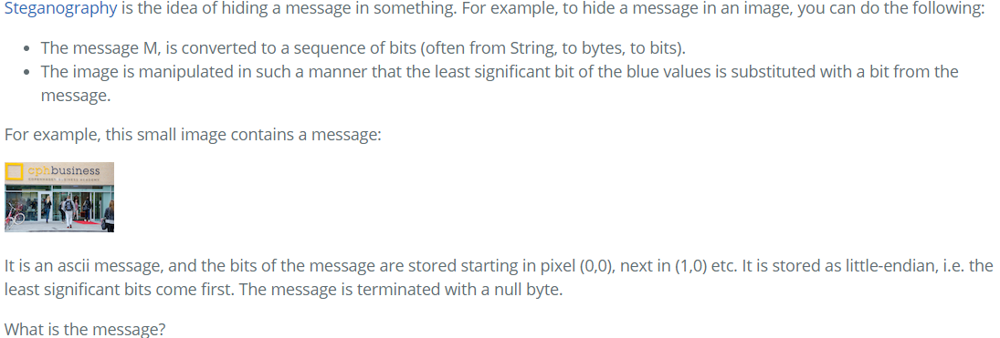

# UFO - Assignment Work log & Steganography Challenge
- Jonatan Bakke https://github.com/JonatanMagnusBakke
- Jonas Hein - https://github.com/Zenzus
- Thomas Ebsen - https://github.com/Srax 
- [Exercise Link](https://datsoftlyngby.github.io/soft2021spring/UFO/week-05/#1-introduction-to-exploration-and-presentation)

## Homework Assignment
In order to look at self reflection and to judge your assessment of information, you should solve the programming exercise below.

However - the important thing in this exercise is how you solved it, not the end result.

At the end of the programming exercise you should have:

* A list of all search queries you made to solve it, and timestamps (just copy it from the browser history)
* A list all pages you visited to solve it (just copy it from the browser history)
* A list of the 3 biggest stumbling blocks you came across and your reflection on why they were problematic (did you misunderstand something, was some of the info you found wrong, did you miss a detail, …)
* A brief "every 30 min" diary as explained in the slides (this is more frequent than one would normally do, and is just meant as part of the exercise)

### List of all search quaries we did to solve it

  
Jonatan - (click me)
    

 

  
Jonas - (click me)
    

-  12:56 PM python - Pillow installed, but getting "no module named pillow" when importing - Stack Overflow  
- 12:55 PM francescortiz/image: Django application that provides cropping, resizing, thumbnailing, overlays, tint and mask for images and videos with the ability to set the center of attention in order to have automatic perfect cropping.
- 12:53 PM python - ImportError: No module named PIL - Stack Overflow
- 12:53 PM from PIL import Image ModuleNotFoundError: No module named 'Image' - Google Search
- 12:52 PM Python Pillow - Using Image Module - Tutorialspoint
- 12:51 PM how to import pillow python - Google Search
- 12:50 PM Installing, Importing, and Aliasing Modules in Python 3 | DigitalOcean
- 12:49 PM how to inport libary in python - Google Search
- 12:42 PM Installation — Pillow (PIL Fork) 5.1.0 documentation
- 12:40 PM Pillow — Pillow (PIL Fork) 5.1.0 documentation
- 12:40 PM python - Can't import PIL library - Stack Overflow
- 12:40 PM can't import pil python - Google Search
- 12:38 PM Python Script 13: Generating ascii code from Image - https://pythoncircle.com
- 12:38 PM how to find ascii message stored in pixel python - Google Search
- 12:35 PM www.pythonware.com
- 12:25 PM What Is Little-Endian And Big-Endian Byte Ordering? | Section
- 12:25 PM what is little-endian - Google Search
- 12:16 PM Social Network for Programmers and Developers
- 12:16 PM Python Program to Find ASCII Value of Character

  

  
Thomas - (click me)
    

  - 12:23 Google - What is stenography
  - 12:23 https://en.wikipedia.org/wiki/Shorthand
  - 12:25 Google - Python Steganography
  - 12:25 https://www.geeksforgeeks.org/image-based-steganography-using-python/
  - 12:35 Google - python steganography image pixels
  - 12:35 https://medium.com/swlh/lsb-image-steganography-using-python-2bbbee2c69a2
  - 12:45 Google - python ascii image steganography
  - 12:47 https://www.tutorialspoint.com/image-based-steganography-using-python
  - 12:50 Google - how to find hidden message in image at pixel value
  - 12:51 http://citeseerx.ist.psu.edu/viewdoc/download?doi=10.1.1.60.457&rep=rep1&type=pdf
  - 12:57 Google - Little-endian 
  - 12:57 https://searchnetworking.techtarget.com/definition/big-endian-and-little-endian
  - 13:05 Google - Python Pillow rgba get pixel at blue channel
  - 13:10 https://stackoverflow.com/questions/59320564/how-to-access-and-change-color-channels-using-pil
  - 13:21 Google - Python binary to ascii
  - 13:21 https://www.tutorialspoint.com/python_text_processing/python_conversion_binary_ascii.htm#:~:text=The%20ASCII%20to%20binary%20and,data%20and%20do%20the%20conversion.

 

## Question to be investigated

## How to run
1. Clone the project
2. You need pythong to run this project, download it [here](https://www.python.org/downloads/)  
3. Open a `CMD`and navigate to the root of the project folder
4. Run command `py program.py`
5. You should now see the message: **`Congratulations, this is the secret message of the UFO class! (no, not 42)`**

